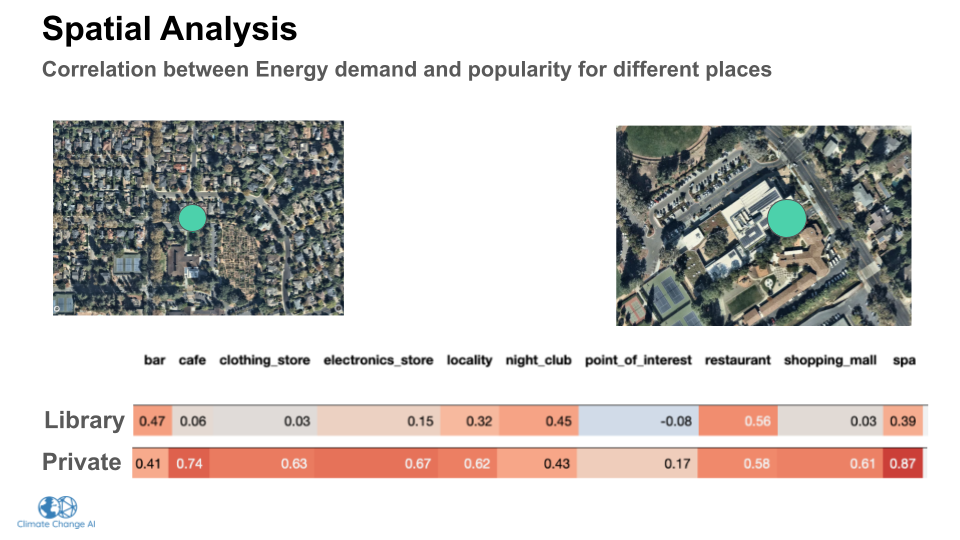

# CCAI Summer School 2022 

> Transportation - Team project 

The adoption number of electric vehicles (EVs) has increased significantly worldwide due to its environmental, social, and economic benefits. Therefore, the management of EV charging stations has become a crucial topic in supporting this adoption's success. This project aims to evaluate the spatial and temporal impact of managing EV charging stations. Then, we use the temporal-spatial characteristics to predict and manage the EV charging stations.

	
	 

